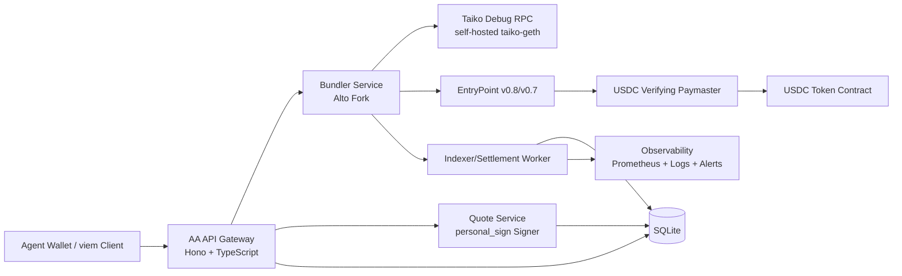

# Taiko Bundler + USDC Paymaster Architecture

## 1) Goals

- Let agents submit ERC-4337 `UserOperation`s on Taiko and pay gas in USDC.
- Keep UX zero-config: no API key, no account creation, no manual policy setup.
- Stay close to ERC-4337 standard flows and Circle-style pay-in-token UX.
- Ship fast with a TypeScript-first stack and production safety controls.

## 2) Non-Goals (MVP)

- Multi-token gas payment.
- Cross-chain settlement or shared global balances.
- Full policy management UI.
- EIP-7702-specific flows (Taiko path is 4337-first).

## 3) Architecture Decisions

- Bundler base: fork `pimlicolabs/alto` (TypeScript) for faster integration with our stack.
- Paymaster style: verifying paymaster with signed quotes and USDC settlement in `postOp`.
- Pricing model: off-chain quote service is the single pricing authority and signs bounded quotes; no external oracle calls in on-chain validation.
- Data store: SQLite for MVP operations (quote nonce tracking, sponsorship records, replay protection).
- Node requirement: self-hosted Taiko node (or provider) with `debug_traceCall` enabled.

## 4) Component Diagram

## 5) Technology Stack

- API and orchestration: `TypeScript`, `Node.js`, `Hono`.
- Bundler: `Alto` fork (TypeScript), exposed through JSON-RPC.
- Contracts: Solidity `^0.8.24` (or latest stable `0.8.x` used in repo).
- Contract tooling: Hardhat + Foundry tests (Hardhat for deployment scripts, Foundry for fast fuzz/invariant tests).
- Database: SQLite (`better-sqlite3` or equivalent) with WAL mode.
- Containers: Docker, docker-compose for local orchestration.
- Metrics/logging: Prometheus metrics endpoint + structured JSON logs.

## 6) Core Services

### 6.1 AA API Gateway

Responsibilities:

- Public entrypoint for agent traffic.
- Expose REST routes for quote/paymaster-data generation.
- Proxy standard ERC-4337 JSON-RPC methods to bundler.
- Attach tracing IDs and persist lifecycle state.

Key routes (MVP):

- `POST /rpc`
  - JSON-RPC gateway for `pm_getPaymasterStubData`, `pm_getPaymasterData`, `eth_sendUserOperation`, `eth_estimateUserOperationGas`, `eth_getUserOperationReceipt`, and `eth_supportedEntryPoints`.
- `GET /health`
  - Aggregated health of API, DB, bundler, and debug RPC availability.

### 6.2 Bundler Service (Alto Fork)

Responsibilities:

- Maintain UserOp mempool.
- Simulate and validate UserOps.
- Build and submit bundles to EntryPoint.
- Support configured EntryPoint versions (v0.8 primary, v0.7 optional compatibility).

Required runtime configuration:

- `entrypoints`: include Taiko target EntryPoint address set.
- `rpc-url`: debug-enabled Taiko RPC.
- signer keys for bundle submission.

### 6.3 Quote Service

Responsibilities:

- Compute max USDC charge from gas bounds and signed pricing policy.
- Read ETH/USD and USDC/USD off-chain from Chainlink mainnet, with Coinbase and Kraken fallback quorum checks.
- Sign quote payload as an EIP-191 `personal_sign` over Pimlico's custom UserOp hash (see `SingletonPaymasterV7._getHash`).
- Bake the Servo surcharge (default 5%) into the signed `exchangeRate` rather than carrying a separate BPS field.
- Enforce quote expiry via `validUntil` / `validAfter` and gas-cost bounds off-chain before signing.

Inputs:

- chain fee data, gas limits, token/ETH pricing sources.

Outputs:

- signed quote fields embedded into `paymasterData`.
- fully packed `paymasterAndData = paymaster || paymasterVerificationGasLimit || paymasterPostOpGasLimit || paymasterData`.

### 6.4 Indexer / Settlement Worker

Responsibilities:

- Consume EntryPoint + Paymaster events.
- Reconcile expected vs actual token charges and refunds.
- Persist sponsorship records and failure reasons for analytics/alerts.

## 7) UserOperation Lifecycle (Data Flow)

1. Agent builds a partial `UserOperation`, including `initCode` if the account is still counterfactual.
2. Agent calls `pm_getPaymasterStubData` to learn gas bounds, the paymaster address, the token address, and `maxTokenCost`.
3. If the account lacks allowance, the client signs an EIP-2612 permit and prepends it to the account `callData` in the same UserOperation.
4. Agent calls `pm_getPaymasterData` for the exact final `UserOperation`.
5. API returns the fully packed paymaster payload plus gas limits and validity window.
6. Agent signs and submits the full UserOp via `eth_sendUserOperation` to the bundler.
7. Bundler simulates the final UserOp using debug trace against Taiko state.
8. Bundler bundles and submits `handleOps`.
9. EntryPoint calls paymaster validation, the account executes, and `postOp` settles the final USDC charge.
10. Indexer records `UserOperationSponsored` and lifecycle status.

## 8) Smart Contract Architecture

## 8.1 Contracts

- `ServoPaymaster` (main contract)
  - Inherits Pimlico's `SingletonPaymasterV7` (vendored from `pimlicolabs/singleton-paymaster` under `packages/paymaster-contracts/src/pimlico/`) and adds an admin-gated `withdrawToken` sweep for the pooled treasury.
  - ERC-20 mode only in practice; Servo pools USDC on the contract itself (`treasury = address(this)`).
  - Emits Pimlico's `UserOperationSponsored` event on every charged UserOp.
- `ServoAccount` (canonical agent account)
  - Single-owner ERC-4337 account used by ServoAccountFactory.
  - Supports ERC-1271 permit validation and ERC-721 safe receipt via OpenZeppelin `ERC721Holder`, so registries that mint with `_safeMint` can mint directly to the account.
- `PaymasterSignerRegistry` (optional module)
  - Maintains authorized quote signer keys.
- `PriceSafetyConfig` (optional module)
  - Stores protocol-level guardrails (max surcharge, max quote TTL, max gas limits).

## 8.2 Paymaster Data Layout (Pimlico ERC-20 Mode)

`paymasterAndData` = outer envelope || inner config || signature. Exact byte offsets are parsed by
`BaseSingletonPaymaster._parseErc20Config`:

- paymaster address (20 bytes)
- paymasterVerificationGasLimit (16 bytes)
- paymasterPostOpGasLimit (16 bytes)
- mode + allowAllBundlers byte (1 byte): `(mode << 1) | allowAllBundlers` — Servo sends `0x03`
- flags byte (1 byte): bit 0 = constantFeePresent, bit 1 = recipientPresent, bit 2 = preFundPresent — Servo sends `0x00`
- validUntil (6 bytes)
- validAfter (6 bytes)
- token (20 bytes) = USDC
- postOpGas (16 bytes) — Pimlico penalty calculation input
- exchangeRate (32 bytes) = tokens per 1 ETH (1e18 wei) in token base units, with the 5% Servo surcharge already baked in
- paymasterValidationGasLimit (16 bytes)
- treasury (20 bytes) = the `ServoPaymaster` contract itself
- signature (64 or 65 bytes): `personal_sign(keccak256(abi.encode(userOpHashCustom, chainId)))` from the `PAYMASTER_QUOTE_SIGNER_PRIVATE_KEY` account

## 8.3 Validation Path

`validatePaymasterUserOp` checks:

- EntryPoint caller.
- Supported token address (`USDC` only in MVP).
- Signed quote authenticity, expiry, and replay protection.
- Gas bounds sanity (`verificationGas`, `postOpGas`, max fee constraints).
- Full sponsorship hash binding across UserOp gas fields and signed quote terms.

Returns context for `postOp` settlement.

## 8.4 Settlement Path (`postOp`)

- Compute actual token charge from actual gas cost + signed surcharge and signed exchange rate.
- Pull USDC in `postOp` after the account's batched permit/allowance path has already executed.
- Refund excess if prefund > actual.
- Emit accounting event with effective price/cost values.

## 8.5 Oracle / Pricing Strategy

- No external oracle call inside contract validation.
- Off-chain quote service computes price and signs bounded quote terms, including the exchange rate used in settlement.
- Safety rails:
  - short TTL (for example 30-90 seconds)
  - max slippage cap
  - max absolute USDC charge cap

## 9) API Contract Design

## 9.1 JSON-RPC (public)

Pass-through standard methods:

- `eth_supportedEntryPoints`
- `eth_estimateUserOperationGas`
- `eth_sendUserOperation`
- `eth_getUserOperationReceipt`

Compatibility goals:

- Works with viem/permissionless clients.
- No custom auth headers required for basic flow.

## 9.2 REST (control plane)

- `GET /capabilities`
- `GET /v1/ops/:userOpHash`

All REST responses include deterministic error codes for client retry behavior.

## 10) Deployment Architecture

## 10.1 Runtime Topology

- `api` container
- `bundler` container
- `indexer` container
- `sqlite` volume
- `taiko-geth` (or managed debug-capable RPC endpoint)

## 10.2 Production Requirements

- Debug RPC support (`debug_traceCall`) is mandatory for secure bundler simulation.
- At least one private RPC endpoint; optional secondary failover endpoint.
- Secrets management for bundler signer keys and quote signer keys.
- TLS termination + rate limiting at edge.

## 10.3 Observability

- Metrics:
  - userops accepted/rejected
  - simulation failures by reason
  - bundle inclusion latency
  - sponsorship volume and USDC totals
  - postOp failures/refund deltas
- Alerts:
  - debug RPC unavailable
  - paymaster deposit below threshold
  - abnormal reject rate spikes

## 11) Security Model

- Replay protection via quote hash tracking.
- Strict quote TTL and chain binding.
- Quote signatures bind the sponsorship-relevant UserOp fields, gas limits, max token charge, exchange rate, surcharge, expiry, and quote nonce.
- Circuit breaker to disable sponsorship when the pricing backend is stale or outside deviation thresholds.
- Separate keys:
  - bundler tx sender key
  - quote signer key
  - admin key for contract config

## 12) Testing Strategy

- Unit tests (contracts):
  - signature validation
  - nonce replay rejection
  - settlement/refund math
  - edge cases for `postOp` modes
- Unit tests (API/services):
  - quote creation validation
  - RPC proxy behavior
  - deterministic error mapping
- Integration tests:
  - end-to-end UserOp from quote to receipt
  - failure modes: expired quote, underfunded USDC, RPC trace failure
- Load tests:
  - sustained UserOp submission under realistic gas volatility

## 13) MVP Delivery Phases

1. Contracts + local bundler integration on Taiko testnet.
2. Quote service + REST API + DB persistence.
3. End-to-end settlement and refund event indexing.
4. Hardening (alerts, failover RPC, rate limits) and security review.

## 14) Open Questions Before Implementation

- Final canonical EntryPoint set for Taiko production deployment (v0.8 only or dual v0.7/v0.8).
- Preferred USDC token contract addresses per environment.
- Surcharge model for MVP (`0%` vs configurable flat percentage).
- Whether to expose the paymaster address directly in capabilities, even though `pm_getPaymasterStubData` already reveals the spender for no-SDK clients.
